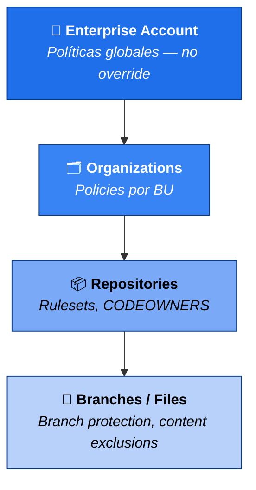
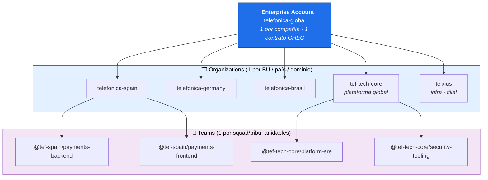
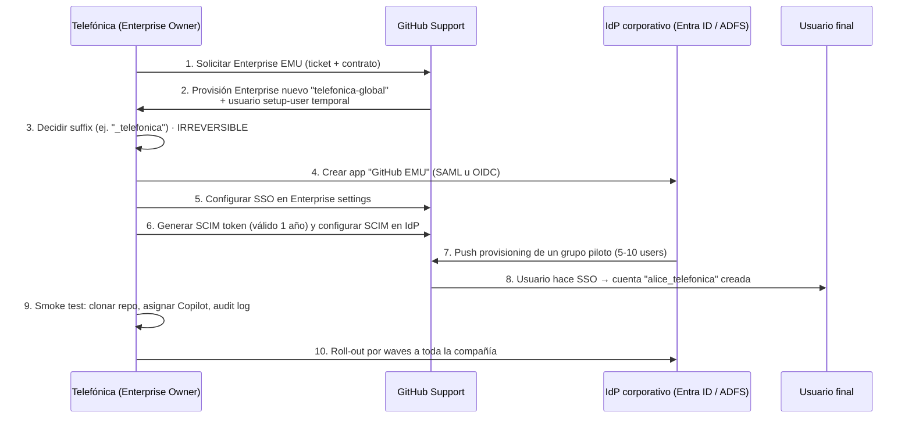
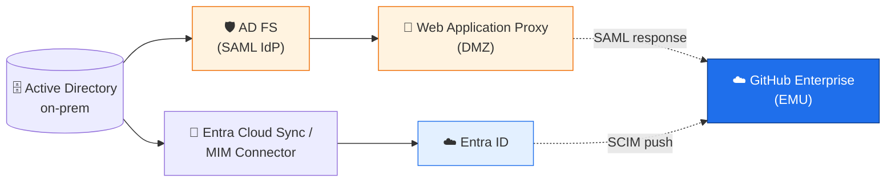
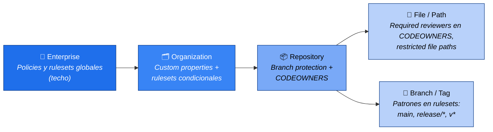
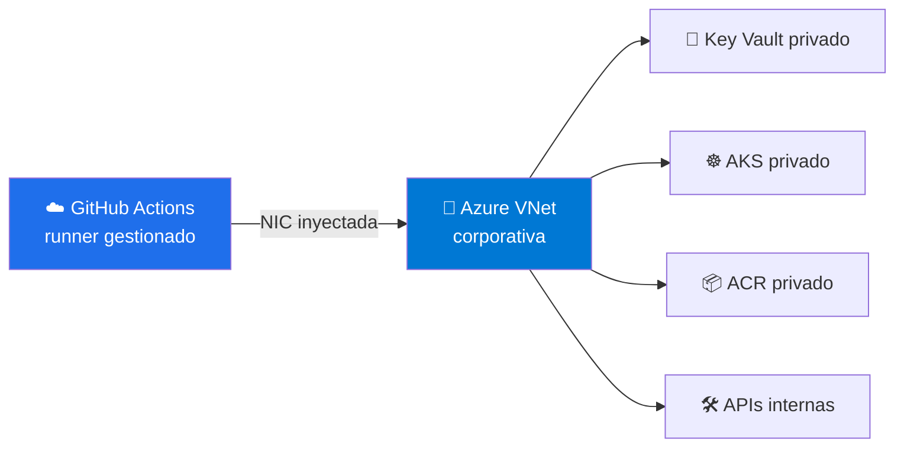

# 01 · Gobernanza y control (25 min)

> ⏱️ **11:05 – 11:30** · Speaker: Líder de Plataforma + SecOps  
> 🎯 **Outcome:** salir con una **policy matrix** definida y conociendo exactamente dónde se configura cada control en GitHub.

---

## 0. Mapa mental (1 min)

La gobernanza de Copilot en GitHub Enterprise se aplica en **4 capas** que se aplican en cascada:



> 🔑 **Regla de oro:** lo que se decide en Enterprise gana siempre. Las Orgs pueden ser más restrictivas, nunca más permisivas.

---

## 1. Gestión de accesos (10 min)

> 🧭 Esta sección es la **piedra angular** del módulo. Si la jerarquía Enterprise → Orgs → Teams
> y la identidad (EMU + SSO + SCIM) no están bien montadas, todo lo demás (policies, content
> exclusions, audit log) se aplica sobre arena.  
> Para el deep-dive con diagramas, snippets AD FS PowerShell, plantillas Keycloak y
> troubleshooting → ver [`anexos/identidad-emu-sso.md`](./anexos/identidad-emu-sso.md).

### 1.1 Estructura jerárquica: Enterprise · Organizations · Teams

GitHub Enterprise Cloud impone una jerarquía **estricta de 3 niveles** que conviene mapear
explícitamente al organigrama de Telefónica antes de tocar ninguna policy.



**Qué se decide en cada capa (y qué NO se puede mover):**

| Capa | Decisiones que vive aquí | Quién manda | ¿Override por debajo? |
|------|--------------------------|-------------|------------------------|
| **Enterprise Account** | Contrato GHEC, modalidad EMU/estándar, SSO/SCIM, billing, **policies globales de Copilot**, audit log streaming, EU Data Residency | Enterprise Owners (≤ 5) | ❌ No — solo se puede ser **más restrictivo** debajo |
| **Organization** | Membresía efectiva, repos, **policies específicas de Copilot** dentro de lo permitido por Enterprise, content exclusions, custom roles, secret scanning defaults | Org Owners + `copilot-admin` (custom role) | ❌ A repo solo se restringe más |
| **Team** | Permisos sobre repos, asignación de Copilot, CODEOWNERS, reviewers automáticos | Team maintainers | ✅ Por repo se puede afinar |

> 🔑 **Regla operativa Telefónica:** **1 Org por BU** (no 1 Org global), **teams sincronizados
> desde el IdP** (nunca creados a mano), y **el suffix EMU se decide UNA SOLA VEZ** para todo el
> grupo.

**Convención de naming recomendada:**

| Recurso | Patrón | Ejemplo |
|---------|--------|---------|
| Enterprise | `<empresa>-global` | `telefonica-global` |
| Organization | `<empresa>-<bu/país>` | `telefonica-spain`, `tef-tech-core` |
| Team | `<dominio>-<función>` | `payments-backend`, `platform-sre` |
| Repo | `<producto>-<componente>` | `payments-api`, `pricing-core` |
| Custom role | `<rol>-<scope>` | `copilot-admin`, `secops-readonly` |

---

### 1.2 Enterprise Managed Users (EMU) — en profundidad

EMU es la modalidad de GitHub Enterprise Cloud en la que **el IdP corporativo es la única
fuente de verdad de identidades**. Para Telefónica (multinacional regulada, GDPR, ENS, NIS2)
es la opción recomendada en los BUs core. Es una **decisión irreversible** y con
implicaciones operativas serias: hay que entenderla bien.

#### 1.2.1 EMU vs GHEC estándar — qué cambia

| Aspecto | GHEC estándar | **EMU** |
|---------|---------------|---------|
| Identidad | Cuentas personales GitHub.com que hacen SSO | Cuentas **dedicadas** provisionadas por el IdP |
| Username | El que el usuario eligió | `alice_telefonica`, `bob_telefonica` (suffix fijo) |
| Provisioning | Manual / invitación + SCIM opcional | **SCIM obligatorio** — no hay invitaciones manuales |
| Colaboración pública | Sí (puede contribuir a OSS desde la misma cuenta) | ❌ No — la cuenta EMU vive aislada del GitHub público |
| Repos personales | Sí | ❌ No existen |
| Marketplace | Apps públicas instalables | Solo apps **explícitamente whitelisted** |
| Reversibilidad | Migración bidireccional posible | ❌ **No reversible** — crear nuevo Enterprise para revertir |
| IdPs soportados | SAML (Entra, Okta, Ping, ADFS, etc.) | **SAML** (Entra/Okta/Ping/PingOne) **o OIDC** (solo Entra ID) |
| Auditoría | Logs por org y enterprise | Logs **completos** del ciclo de vida del usuario |

> ✅ **Cuándo elegir EMU en Telefónica:** BUs core, reguladas o con datos sensibles
> (payments, telco, salud, banca). Patrón por defecto del grupo.  
> ⚠️ **Cuándo NO:** equipos que **contribuyen activamente a OSS público** (DevRel, Open
> Source PMO). Para estos: Org separada en un Enterprise estándar paralelo, o uso de cuentas
> personales en otro tenant.

#### 1.2.2 Pasos de activación (orden estricto)

> ⚠️ El proceso requiere **coordinación con GitHub Sales/Support** y **un Enterprise nuevo**:
> no se convierte un Enterprise estándar existente en EMU. Plazo típico: 2-4 semanas.



**Decisiones que hay que tomar ANTES de pedir el Enterprise:**

| Decisión | Implicación si te equivocas |
|----------|------------------------------|
| **Suffix** (ej. `_telefonica`, `_tef`) | Sale en todos los usernames, **no se puede cambiar** |
| **IdP primario** (Entra vs Okta vs Ping) | Cambiarlo después = re-federar todo |
| **Modo SAML u OIDC** | OIDC solo con Entra ID; SAML universal |
| **Política de username** (qué atributo del IdP → `userName` SCIM) | Difícil de retocar sin downtime |
| **Plan de roll-out por waves** | Big-bang en 50k usuarios = soporte saturado |

#### 1.2.3 Limitaciones que hay que comunicar al negocio

- ❌ No se puede contribuir a repos públicos de GitHub.com desde la cuenta corporativa.
- ❌ No hay perfil público, ni gists públicos, ni starring de repos externos visible.
- ❌ Marketplace restringido: solo apps que el Enterprise Owner haya aprobado.
- ⚠️ Algunas integraciones (CodeSpaces personales, GitHub Pages personales) cambian de comportamiento.
- ⚠️ Plazos: 2-4 semanas de setup inicial, no es un cambio de checkbox.

---

### 1.3 SSO + SCIM con **Entra ID (Azure)** — paso a paso

Es la ruta recomendada y mayoritaria en Telefónica. Cubre **SAML (autenticación)** + **SCIM
(provisioning)** + **Push de grupos** para alimentar los teams.

#### 1.3.1 Lado Entra ID (Azure)

1. **Crear la Enterprise Application:**
   - Portal Azure → Entra ID → **Enterprise applications** → *New application*.
   - Galería: buscar **"GitHub Enterprise Managed User"** (para EMU) o **"GitHub Enterprise Cloud — Enterprise Account"** (para GHEC estándar).
2. **Configurar SAML:**
   - *Single sign-on* → SAML.
   - Identifier (Entity ID): `https://github.com/enterprises/<telefonica-global>`
   - Reply URL (ACS): `https://github.com/enterprises/<telefonica-global>/saml/consume`
   - Sign-on URL: `https://github.com/enterprises/<telefonica-global>/sso`
   - Descargar el **Federation Metadata XML** (lo subes a GitHub).
3. **Atributos y claims** (mínimo necesario):

   | Claim | Source attribute |
   |-------|-------------------|
   | `Unique User Identifier (Name ID)` | `user.userprincipalname` |
   | `emails[0].value` | `user.mail` |
   | `name.givenName` | `user.givenname` |
   | `name.familyName` | `user.surname` |
   | `externalId` | `user.objectid` |

4. **Asignar usuarios y grupos** a la app (los que no estén asignados no podrán hacer login).

#### 1.3.2 Lado GitHub Enterprise

1. `https://github.com/enterprises/<telefonica-global>/settings/single_sign_on`
   - **Enable SAML authentication** → pegar el metadata o los 3 campos (Sign-on URL, Issuer, Certificate).
   - **Require SAML SSO for all users** ✅ (forzado).
2. `…/settings/authentication_security` → **Require 2FA** ✅ (Entra ID ya lo hará por Conditional Access, pero defensa en profundidad).
3. `…/settings/scim`:
   - Generar **Personal Access Token con scope `scim:enterprise`** (1 año, rotación en calendario).
   - Endpoint SCIM: `https://api.github.com/scim/v2/enterprises/<telefonica-global>`
4. **Volver a Entra ID → la app → Provisioning:**
   - Mode: **Automatic**.
   - Tenant URL: `https://api.github.com/scim/v2/enterprises/<telefonica-global>`
   - Secret token: el PAT generado.
   - **Test connection** ✅ → guardar.
   - Mapeo de atributos: dejar el de la galería; verificar `userName` → `mail` (sin el suffix; GitHub lo añade).

#### 1.3.3 Push de grupos → Teams sincronizados

Esto es lo que permite asignar Copilot por team sin tocarlo a mano:

1. En la app de Entra ID → **Provisioning** → **Provision Microsoft Entra groups** = ON.
2. Asignar los grupos a la app (ej. `gh-spain-payments-backend`, `gh-tech-core-sre`).
3. En GitHub: `Org settings → Identity provider → Synced teams` → cada grupo aparece como team disponible para sincronizar.
4. **Patrón Telefónica:** convención `gh-<org>-<team>` para que el matching sea automático y auditable.

#### 1.3.4 Conditional Access — controles imprescindibles

En Entra ID → Conditional Access → nueva policy aplicada a la app de GitHub:

- ✅ Require **MFA** (idealmente phishing-resistant: FIDO2 / Windows Hello).
- ✅ Require **compliant device** (Intune).
- ✅ Block **legacy authentication**.
- ✅ Sign-in risk = **Medium or above** → block o step-up.
- ⚠️ Geo-fencing: bloquear países donde Telefónica no opera (cuidado con roaming legítimo de empleados).

---

### 1.4 SSO con IdPs **on-prem** (AD FS, Keycloak, Ping, Okta on-prem)

> ⏩ **Live:** según audiencia (BUs 100 % Entra ID), el facilitador puede dar esta sección como
> referencia y remitir a [`anexos/identidad-emu-sso.md §5-§7`](./anexos/identidad-emu-sso.md#5-setup-con-ad-fs-on-prem--completo) para el deep dive. Esto deja los 2 min del lab dentro del slot de 25 min.

No todos los BUs de Telefónica están 100 % en Entra ID. Hay filiales con AD FS legacy,
otras con Keycloak (proyectos open source internos) y algunas en migración. GitHub Cloud
sigue siendo el plano de control único, pero el IdP puede ser on-prem si cumple los
requisitos.

#### 1.4.1 Requisitos de red

GitHub.com (cloud) **no inicia conexiones** hacia el IdP. Lo que sí hace falta:

- **SAML SP-initiated flow:** el **navegador del usuario** debe poder llegar al endpoint
  del IdP (HTTPS público o publicado vía Web Application Proxy / reverse proxy en DMZ).
- **SCIM:** el IdP **sí inicia** conexiones hacia `api.github.com` → necesita salida a
  internet HTTPS (firewall outbound rule). AD FS **no hace SCIM nativo**: ver §1.4.2.
- **Certificados:** el certificado del IdP usado para firmar SAML responses debe estar
  **vigente** y subido a GitHub (rotación = downtime si no se anticipa).

#### 1.4.2 Matriz de soporte por IdP on-prem

| IdP | SAML 2.0 | OIDC | SCIM nativo | EMU OK | Patrón recomendado |
|-----|----------|------|-------------|--------|---------------------|
| **AD FS** (Windows Server) | ✅ | ⚠️ Parcial | ❌ | ⚠️ Sí pero sin SCIM | Hybrid: ADFS para SAML + Entra Cloud Sync para SCIM |
| **Keycloak** (self-hosted) | ✅ | ✅ | ⚠️ Plugin externo | ⚠️ Solo SAML | SAML + plugin `keycloak-scim` o MIM bridge |
| **PingFederate** (on-prem) | ✅ | ✅ | ✅ (con PingDirectory) | ✅ | App de la galería GitHub |
| **Okta on-prem AD Agent** | ✅ | ✅ | ✅ | ✅ | App de la galería; AD Agent en DMZ |
| **OpenLDAP / FreeIPA** | ❌ | ❌ | ❌ | ❌ | Necesita IdP delante (Keycloak/ADFS) |

#### 1.4.3 Patrón **AD FS** (el más común en filiales legacy)



**Pasos resumidos (detallado en el anexo):**

1. En AD FS Management → **Add Relying Party Trust** → import metadata desde
   `https://github.com/enterprises/<telefonica-global>/saml/metadata`.
2. **Claim rules** mínimas:
   - `LDAP Attribute → outgoing claim`: `mail` → `Name ID` (formato Email).
   - `mail` → `emails[0].value`, `givenName` → `name.givenName`, `sn` → `name.familyName`.
3. Publicar el endpoint vía **Web Application Proxy** en DMZ (URL pública del IdP).
4. Para SCIM, montar **Entra Cloud Sync** o **MIM** que lea de AD y empuje a GitHub SCIM
   API (AD FS no lo hace nativo).

**Snippet PowerShell** (en el servidor AD FS, como Admin):

```powershell
Add-AdfsRelyingPartyTrust `
  -Name "GitHub EMU - telefonica-global" `
  -MetadataUrl "https://github.com/enterprises/telefonica-global/saml/metadata" `
  -IssuanceAuthorizationRules '@RuleTemplate = "AllowAllAuthzRule" => issue(Type = "http://schemas.microsoft.com/authorization/claims/permit", Value = "true");' `
  -IssuanceTransformRules @"
@RuleTemplate = "LdapClaims"
@RuleName = "GitHub claims"
c:[Type == "http://schemas.microsoft.com/ws/2008/06/identity/claims/windowsaccountname", Issuer == "AD AUTHORITY"]
 => issue(store = "Active Directory",
          types = ("http://schemas.xmlsoap.org/ws/2005/05/identity/claims/nameidentifier",
                   "http://schemas.xmlsoap.org/ws/2005/05/identity/claims/emailaddress",
                   "http://schemas.xmlsoap.org/ws/2005/05/identity/claims/givenname",
                   "http://schemas.xmlsoap.org/ws/2005/05/identity/claims/surname"),
          query = ";mail,mail,givenName,sn;{0}", param = c.Value);
"@
```

> ⚠️ Sustituir `telefonica-global` y validar primero contra un Enterprise de test. Una claim rule mal escrita = todos los usuarios bloqueados.

#### 1.4.4 Patrón **Keycloak** (open source, varios proyectos internos)

- Crear un **Client** tipo SAML en el realm corporativo.
- Client ID = el Entity ID que GitHub espera (`https://github.com/enterprises/<telefonica-global>`).
- Asignar mappers para `email`, `givenName`, `familyName`, `nameID-format=email`.
- Para SCIM: instalar el plugin [`keycloak-scim`](https://github.com/Captain-P-Goldfish/scim-for-keycloak) o usar un broker intermedio.
- Detalle paso a paso en el anexo.

#### 1.4.5 Recomendación estratégica para Telefónica

> 🎯 **Patrón objetivo (target state):** AD on-prem como source of truth → **Entra Cloud
> Sync** → **Entra ID** como único plano de federación → GitHub EMU.  
> Los AD FS / Keycloak existentes se mantienen como **bridge transicional** durante la
> migración, no como destino final. SecOps + IT Corporativo deben tener este patrón
> documentado y con SLA de migración por BU.

---

### 1.5 Asignación de Copilot por teams sincronizados

Con la jerarquía e identidad bien montadas, asignar Copilot deja de ser ticketing manual:

| Modo | Cuándo usarlo | Riesgo |
|------|---------------|--------|
| **Asignación manual** | < 50 usuarios, piloto inicial | Olvidas dar de baja → idle seats |
| **Teams sincronizados desde IdP** (recomendado) | Estándar Telefónica | Ninguno si los grupos están bien mantenidos |
| **Asignación a toda la Org** | Equipos donde el 100 % usa Copilot | Idle seats si la adopción real < 80 % |

**Configurar por UI:**

1. `https://github.com/enterprises/<telefonica-global>/copilot/seat_management`
2. Pestaña **Access** → *"Assign seats to selected users or teams"*.
3. En cada Org: `Settings → Identity provider → Synced teams` (alimentados por el push de grupos del §1.3.3).
4. Marcar los teams que reciben licencia.

**Vía API (auditable y reproducible — IaC-friendly):**

```bash
# Listar todos los seats actualmente asignados en una org
gh api -H "Accept: application/vnd.github+json" \
  /orgs/<org>/copilot/billing/seats --paginate

# Asignar Copilot a un team completo
gh api --method POST \
  /orgs/<org>/copilot/billing/selected_teams \
  -f selected_teams[]="plataforma-backend" \
  -f selected_teams[]="plataforma-frontend"

# Quitar Copilot a usuarios concretos
gh api --method DELETE \
  /orgs/<org>/copilot/billing/selected_users \
  -f selected_usernames[]="alice_telefonica" \
  -f selected_usernames[]="bob_telefonica"
```

### 1.6 Roles mínimos necesarios

| Función | Rol mínimo |
|---------|-----------|
| Cambiar policies de Copilot | Enterprise Owner |
| Activar/cambiar SSO o SCIM | Enterprise Owner |
| Sincronizar teams con IdP | Org Owner |
| Asignar seats | Org Owner o **Copilot Admin** (custom role) |
| Ver métricas de uso | `read:enterprise` + `manage_billing:copilot` |
| Leer audit log enterprise | Enterprise Owner o Security Manager |
| Aplicar content exclusions | Org Owner / Repo Admin |

> 📌 **Recomendación:** crear un **custom role** `copilot-admin` en cada Org con solo los
> permisos necesarios (no usar Org Owner para esto). Enterprise Owners ≤ 5 personas y todas
> con cuenta EMU separada de la del día a día.

---

## 2. Políticas de uso (8 min)

### 2.1 Catálogo de policies de Copilot (Enterprise)

Ruta: `https://github.com/enterprises/<telefonica>/settings/copilot/policies`

| Policy | Recomendación Telefónica | Por qué |
|--------|--------------------------|---------|
| **Suggestions matching public code** | `Blocked` | Evita riesgo de copyleft; obliga a Copilot a no devolver matches públicos |
| **Copilot Chat in the IDE** | `Allowed` | Necesario para productividad |
| **Copilot in GitHub.com** | `Allowed` | Habilita Copilot Chat, PR summaries, Spaces |
| **Copilot in the CLI** | `Allowed` | Útil para SRE/DevOps |
| **MCP servers** | `Allowed con allow-list` | Solo MCP servers aprobados por SecOps (ver anexo) |
| **Copilot can search the web (Bing)** | `Allowed` con awareness | Útil pero loggear queries |
| **Copilot Extensions** | `Allowed con allow-list` | Igual que MCP: catálogo aprobado |
| **Copilot Coding Agent** | `Allowed` en sandbox / `Restricted` en repos críticos | Ejecuta tareas autónomas — requiere CODEOWNERS estrictos |
| **Editor preview features** | `Disabled` en producción | Estabilidad |
| **Model selection (Claude, GPT, Gemini...)** | `Allowed` modelos aprobados | Telefónica aprueba modelo a modelo |
| **Data retention for prompts** | `Zero data retention` (Enterprise) | Por defecto en Copilot Enterprise |

### 2.2 Content exclusions (clave para Telefónica)

Bloquea archivos/rutas que Copilot **no debe leer ni usar como contexto**. Ideal para:
- Carpetas con datos regulados (PII, datos financieros).
- Algoritmos propietarios (`/src/pricing/core/**`).
- Configs con secretos (aunque deberían estar en un vault).

**Ruta UI:** `Org settings → Copilot → Content exclusion`

**Archivo de ejemplo** (también en `anexos/plantillas/content-exclusions.yml`):

```yaml
# Aplica a TODOS los repos de la org
"*":
  - "**/secrets/**"
  - "**/*.pem"
  - "**/*.key"
  - "**/customer-data/**"

# Por repo específico
"telefonica-payments/pricing-core":
  - "src/algorithms/proprietary/**"
  - "docs/internal/strategy/**"
```

> ⚠️ **Limitación importante:** las exclusiones **no impiden** que un dev abra el archivo manualmente; solo evitan que Copilot lo use como contexto/inspiración.

### 2.3 Defensas complementarias en el repo

Copilot no es la única superficie de riesgo. Activar **siempre**:

- **Secret scanning + push protection**: bloquea push si detecta credenciales.
- **Dependabot**: alertas y PRs automáticos de seguridad.
- **CodeQL** o herramienta SAST equivalente.
- **Branch protection rules** + **Repository rulesets** (ver §3).
- **CODEOWNERS** obligatorio para revisión.

**Activar a nivel Org de golpe:**

```bash
gh api --method PATCH /orgs/<org> \
  -F secret_scanning_enabled_for_new_repositories=true \
  -F secret_scanning_push_protection_enabled_for_new_repositories=true \
  -F dependabot_alerts_enabled_for_new_repositories=true \
  -F dependabot_security_updates_enabled_for_new_repositories=true
```

### 2.4 Granularidad real de las policies (qué se puede / qué no)

Esta es una de las preguntas más frecuentes en cualquier kickoff: *"¿puedo forzar que los repos se llamen `<dominio>-<servicio>`?"*. La respuesta corta: **GitHub no tiene un regex de naming nativo**, pero hay 5 mecanismos para obtener un control equivalente o mejor. Esta es la tabla mental:

#### Lo que **SÍ existe** nativo (sin código)

| Mecanismo | Nivel | Qué controla | Ejemplo |
|-----------|-------|--------------|---------|
| **Repository policies** | Enterprise + Org | Visibility (público/internal/private), deletion, transfer, default branch, force push, fork, invitations, deletion de issues | Bloquear que un dev convierta `payments-api` en público |
| **Repository rulesets** | Enterprise + Org + Repo | Reglas sobre **branches, tags y files** dentro de los repos: PRs requeridas, reviewers mínimos, signed commits, status checks, CODEOWNERS, file size, restricted file paths | Forzar 2 approvals + signed commits + status verde en `main` |
| **Custom Properties** | Org | Metadata estructurada por repo con valores **required** y allowed-values cerrados: `bu`, `team`, `criticality`, `environment`, `data-classification` | Cada repo nuevo no se crea hasta que rellena las 4 properties |
| **Rulesets condicionales por property** | Org | Aplicar ruleset solo a repos donde `criticality=critical AND environment=prod` | Reglas estrictas en prod, laxas en lab — sin tocar los repos uno a uno |
| **Required workflows** | Org | Workflow obligatorio que corre en **todos** los repos | Compliance check en cada push, falla CI si el repo no cumple |
| **Repository templates** | Org | Plantilla "Use this template" con estructura, CODEOWNERS, workflows preconfigurados | Onboarding rápido + estructura consistente (voluntario) |

#### Lo que **NO existe** nativo (necesita automatización)

| Lo que querrías hacer | Cómo conseguirlo |
|------------------------|-------------------|
| Regex en el **nombre del repo** | Webhook `repository.created` → Azure Function/Lambda valida y renombra/borra |
| **Descripción obligatoria** con formato | Required workflow + linter + auto-PR |
| **Topics obligatorios** | GitHub App suscrita a `repository` event |
| **README con secciones obligatorias** | Required workflow que lee `README.md` y falla si no cumple |
| **License específica obligatoria** | Required workflow + bloqueo en branch protection |

#### Patrón recomendado para Telefónica (sin código)

1. **Custom Properties REQUIRED** en cada Org → `bu`, `team`, `criticality`, `environment`, `data-classification`.
2. **2-3 Rulesets condicionales** filtrados por property:
   - `prod-strict`: para repos con `criticality IN (critical, high) AND environment = prod`.
   - `lab-permissive`: para `environment = lab`.
3. **Repository templates** corporativos por arquetipo (microservice, library, infra, web-app).
4. **Required workflow** `compliance-check.yml` que verifica:
   - CODEOWNERS existe.
   - README tiene secciones mínimas.
   - License correcta.
5. (Avanzado) **GitHub App** "repo-compliance-bot" para naming patterns y auto-remediación.

> 💡 **Mensaje clave:** El control fino no se hace por **nombre del repo** (frágil, los devs lo evaden) sino por **properties + rulesets condicionales**. Mejor pensar en "esto es un repo de producción, le aplico reglas estrictas" que en "este repo se llama X, le aplico Y".

#### Granularidad por capa — referencia rápida



### 2.5 Hosted Compute Networking — runners conectados a tu red corporativa

GitHub Actions usa por defecto runners hosted by GitHub que viven en **IPs públicas**. Para Telefónica, eso es un freno operativo cada vez que un workflow tiene que llegar a un recurso privado (Key Vault, AKS privado, ACR, APIs internas). **Hosted Compute Networking** resuelve exactamente eso.

#### Qué hace

Inyecta una **NIC del runner gestionado por GitHub dentro de tu propia VNet de Azure**. El runner se ejecuta en la subscription de GitHub (no lo operas tú), pero la NIC vive en tu red → puede llegar a cualquier recurso privado sin abrir puertos al mundo.



#### Ventajas a nivel Enterprise

| Ventaja | Impacto |
|---------|---------|
| 🔐 **Zero IP pública** en endpoints corporativos | Cumple políticas DORA/NIS2 de no exponer servicios críticos |
| ⚡ **Cero operación de runners** | A diferencia de self-hosted, no parcheas SO ni gestionas escalado |
| 💰 **Pay-per-minute** sin capacity planning | Solo pagas mientras el workflow corre, sin idle VMs |
| 🛡️ **Reglas de tu red aplican** (NSG, Azure Firewall, Private DNS) | El runner hereda toda la postura de seguridad ya definida |
| 🔁 **Combinable con OIDC trust** Azure | Elimina service principal secrets en GitHub Secrets |
| 📊 **Trazable en NSG flow logs** | SecOps ve exactamente qué pidió cada workflow |
| 🧩 **Aislamiento por Org / runner group** | Cada BU usa su VNet/subnet → blast radius acotado |
| 🌐 **Funciona con private endpoints** existentes | Reutilizas el plumbing de red que ya tienes en Azure Landing Zones |

#### Casos de uso típicos en Telefónica

- Deploy a **AKS privado** sin abrir el API server al exterior
- Pull de imágenes desde **ACR private** sin perimeter NAT
- Tests de integración contra **PostgreSQL / Cosmos DB** con private endpoint
- Acceso a **Key Vault privado** durante el build
- Llamadas a **APIs internas** (bus corporativo, IAM) desde pipelines de CI

#### Decisión de gobernanza

| Pregunta | Recomendación |
|----------|---------------|
| ¿Quién crea network configurations? | Solo Enterprise Owners + custom role `platform-network-admin` |
| ¿Una sola VNet compartida o por BU? | **Una por BU/entorno** (`tef-spain-prod`, `tef-germany-prod`…) — limita blast radius |
| ¿Auditar cambios? | Sí — eventos `hosted_compute.*` en audit log → stream a Sentinel |
| ¿OIDC trust con Azure? | Sí, obligatorio — no usar secrets de service principal en GitHub Secrets |

> 💡 **Cuándo NO lo necesitas:** workflows que solo hacen build/test puro, despliegues a servicios públicos, pull a registries públicos. En esos casos, runner GitHub-hosted estándar es más simple y barato.

---

## 3. Cumplimiento normativo (6 min)

| Norma | Implicación práctica |
|-------|----------------------|
| **GDPR / LOPDGDD** | Datos personales no deben fluir a modelos sin base legal |
| **ISO 27001 / ENS** | Auditoría continua, control de accesos, cifrado en tránsito |
| **DORA** (sector financiero del grupo) | Resiliencia operativa: registro de incidentes con proveedores tech |
| **NIS2** | Reporte de incidentes en <24/72h |
| **Política interna de IA generativa** | Catálogo aprobado de modelos + casos de uso |

GitHub Copilot Enterprise cubre de serie:
- **EU Data Residency** (disponible en GHEC desde 2024).
- **Zero data retention** para prompts y respuestas en Copilot Business/Enterprise.
- **SOC 2 Type II**, **ISO 27001/17/18**, **CSA STAR Level 2**.

### 3.2 Audit log — la herramienta clave

El audit log de Enterprise registra **todo evento** relevante de Copilot:

- Asignación/desasignación de seats (`copilot.seat_assigned`, `copilot.seat_cancelled`).
- Cambios de política (`business.update_copilot_business_policy`).
- Acceso a chat (`copilot.chat_event`).
- MCP/Extension activations.

**Consultar desde la UI:**

`https://github.com/enterprises/<telefonica>/audit-log?q=action:copilot`

**Consultar vía API (los últimos 7 días de eventos Copilot):**

```bash
gh api -H "Accept: application/vnd.github+json" \
  "/enterprises/<telefonica>/audit-log?phrase=action:copilot&include=all&per_page=100" \
  --paginate > audit-copilot.json
```

**Streaming continuo** (recomendado para SecOps):

Configurar streaming hacia:
- **Azure Event Hubs** → Sentinel (Telefónica usa Microsoft Sentinel).
- **Splunk HEC**.
- **AWS S3 / Kinesis**.
- **Datadog**.

Ruta: `Enterprise settings → Audit log → Log streaming`.

> 📂 Ver consultas KQL listas para Sentinel en `anexos/scripts/kql-audit-queries.md`.

### 3.3 Retención y evidencia

- Audit log: **180 días** consultables en UI; **infinito** si se hace streaming a almacén propio.
- Métricas Copilot: **28 días** rolling (¡guardar snapshots semanales!).
- Recomendado: job semanal que dumpea métricas y audit a un blob storage corporativo con **immutability policy** (WORM) para evidencia.

---

## 🧪 Lab guiado (incluido en los 25 min)

**Objetivo:** dejar la org `telefonica-sandbox` con la baseline mínima de gobernanza.

```bash
# 1. Verificar el set de policies aplicado
gh api /enterprises/telefonica-copilot-lab/copilot/billing | jq '.seat_breakdown, .public_code_suggestions'

# 2. Activar content exclusions con la plantilla
gh api --method PUT \
  /orgs/telefonica-sandbox/copilot/content-exclusions \
  --input anexos/plantillas/content-exclusions.yml

# 3. Comprobar que las defensas de repo están activas en repos nuevos
gh api /orgs/telefonica-sandbox | jq '{ss: .secret_scanning_enabled_for_new_repositories, pp: .secret_scanning_push_protection_enabled_for_new_repositories, dep: .dependabot_alerts_enabled_for_new_repositories}'

# 4. Exportar audit log de las últimas 24h relacionadas con Copilot
pwsh -File anexos/scripts/export-audit-log.ps1 -Enterprise telefonica-copilot-lab -Hours 24
```

---

## ✅ Checklist de salida del módulo

- [ ] SSO + SCIM operativos y revisados (responsable: IT corporativo).
- [ ] Asignación de Copilot vía **grupos** de Entra ID, no manual.
- [ ] Policies enterprise alineadas con la tabla §2.1.
- [ ] `content-exclusions.yml` desplegado y versionado.
- [ ] Secret scanning + push protection ON por defecto en toda Org nueva.
- [ ] Audit log haciendo streaming a Sentinel (o equivalente).
- [ ] Custom role `copilot-admin` creado.
- [ ] **Policy matrix** rellena para al menos una BU (plantilla en `anexos/plantillas/policy-matrix.md`).

➡️ Siguiente: [`02-modelo-de-costes.md`](./02-modelo-de-costes.md)
