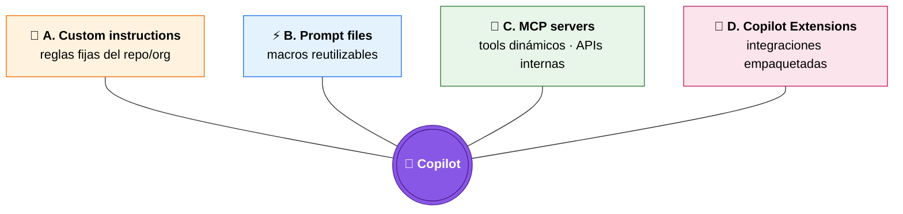

# 03 · Skills y conectores (25 min)

> ⏱️ **11:50 – 12:15** · Speaker: Plataforma DevEx + Arquitecto  
> 🎯 **Outcome:** salir entendiendo las 4 formas de extender Copilot, con un MCP server funcionando y un `copilot-instructions.md` aplicado a un repo real.

---

## 1. Las 4 palancas de extensión (3 min)



| Capa | Vive en | Quién mantiene | Ejemplo Telefónica |
|------|---------|----------------|---------------------|
| Custom instructions | repo / org / personal | TechLead del repo | "Usa Python 3.11, Black, type hints, sigue estilo PEP-8" |
| Prompt files | repo | Equipo | `/generate-rest-endpoint.prompt.md` |
| MCP server | localhost o servicio | Plataforma DevEx | Conector contra Jira interno, contra el catálogo de APIs |
| Copilot Extension | GitHub Marketplace o private | Plataforma DevEx | `@telefonica-sre` para consultas a Grafana |

---

## 2. Custom instructions (5 min)

### 2.1 Tres niveles

| Nivel | Archivo | Alcance |
|-------|---------|---------|
| Personal | Settings GitHub.com de cada usuario | Solo este usuario |
| Repo | `.github/copilot-instructions.md` | Todos los devs de ese repo |
| Repo granular | `.github/instructions/*.instructions.md` con `applyTo:` glob | Por carpeta/tipo de archivo |
| Org (Enterprise) | Configurado en `Org → Copilot → Custom instructions` | Todos los repos de la org |

### 2.2 Ejemplo aterrizado a Telefónica

**`.github/copilot-instructions.md`** del repo `telefonica-payments/pricing-api`:

```markdown
# Contexto del proyecto
Este es el servicio de pricing del dominio Payments en Telefónica.
Stack: Python 3.11, FastAPI, PostgreSQL, Redis, deploy en AKS.

# Convenciones obligatorias
- Tipado estricto: todo público debe tener type hints.
- Logs: usar `structlog` con campos `trace_id`, `tenant_id`. NO `print`.
- Errores HTTP: devolver `application/problem+json` (RFC 7807).
- Tests: pytest + pytest-asyncio. Cobertura mínima 80 %.
- Commits: Conventional Commits en inglés.

# Seguridad
- No introducir dependencias nuevas sin aprobación de SecOps.
- Secrets siempre vía `azure.identity.DefaultAzureCredential`. Nunca en código.
- Validar input con pydantic v2. Nunca `eval`, nunca `exec`.

# Estilo de respuesta de Copilot
- Cuando sugieras código nuevo, incluye también el test asociado.
- Cuando sugieras un cambio en endpoint, recuerda actualizar el OpenAPI spec.
- Si vas a usar una librería nueva, justifica en 1 línea por qué.
```

### 2.3 Instrucciones granulares por tipo de archivo

`.github/instructions/python.instructions.md`:

```markdown
---
applyTo: "**/*.py"
---
- Usa f-strings, no `.format()`.
- Imports ordenados con `isort` (black profile).
- Funciones async siempre con sufijo `_async` solo si conviven con la sync equivalente.
```

`.github/instructions/sql.instructions.md`:

```markdown
---
applyTo: "**/*.sql"
---
- Schema `payments`. Tablas en `snake_case` plural.
- Toda migration usa `BEGIN; ... COMMIT;` y es idempotente.
- No `SELECT *` en código productivo.
```

> 📂 Plantilla completa en `anexos/plantillas/copilot-instructions.md`.

---

## 3. Prompt files (3 min)

Son **plantillas de prompt** versionadas en el repo. Invocables desde Copilot Chat con `/`.

**Estructura:** `.github/prompts/<nombre>.prompt.md`

```markdown
---
mode: agent
model: claude-sonnet-4.6
description: Genera un endpoint REST FastAPI con su test y entrada en OpenAPI.
---
Eres un dev senior de Telefónica trabajando en `pricing-api`.

Genera un endpoint nuevo siguiendo TODAS las reglas de `.github/copilot-instructions.md`.

Necesito:
1. El handler en `app/routers/{resource}.py`.
2. El esquema pydantic en `app/schemas/{resource}.py`.
3. Test pytest en `tests/routers/test_{resource}.py` con casos: ok, validation error, 404.
4. Entrada en `docs/openapi/{resource}.yaml`.

Pídeme el nombre del recurso, los campos y el verbo HTTP antes de generar nada.
```

Uso en Copilot Chat: `/generate-rest-endpoint` → Copilot pregunta, genera, abre PR.

> 💡 Ventaja para Telefónica: estandariza patrones entre equipos y reduce variación.

---

## 4. MCP servers — Model Context Protocol (8 min)

### 4.1 Qué son y por qué importan

**MCP** es un protocolo abierto (Anthropic, ya adoptado por GitHub, OpenAI, etc.) para que un cliente IA (Copilot) consuma **tools** expuestos por servidores. Equivalente a "USB-C para IA".

Permiten a Copilot, durante una conversación, **ejecutar acciones** o **leer datos** que no están en el repo:

- Buscar tickets en Jira interno.
- Consultar el catálogo de APIs corporativo.
- Lanzar una query a Sentinel / Datadog.
- Pedir un secreto efímero a Vault.
- Llamar a un endpoint del sistema de pricing.

### 4.2 Dónde se configura

En VS Code: archivo `.vscode/mcp.json` (a nivel repo, recomendado) o user settings.

**Plantilla** (también en `anexos/plantillas/mcp-config.json`):

```json
{
  "servers": {
    "github": {
      "type": "http",
      "url": "https://api.githubcopilot.com/mcp/",
      "headers": { "Authorization": "Bearer ${input:github_pat}" }
    },
    "telefonica-jira": {
      "type": "http",
      "url": "https://mcp.telefonica.internal/jira",
      "headers": { "Authorization": "Bearer ${input:tef_jira_token}" }
    },
    "telefonica-api-catalog": {
      "type": "stdio",
      "command": "npx",
      "args": ["-y", "@telefonica/mcp-api-catalog@latest"],
      "env": { "TEF_CATALOG_URL": "https://apis.telefonica.internal" }
    },
    "sentinel-readonly": {
      "type": "http",
      "url": "https://mcp.telefonica.internal/sentinel",
      "headers": { "Authorization": "Bearer ${input:sentinel_token}" }
    }
  },
  "inputs": [
    { "id": "github_pat", "type": "promptString", "password": true },
    { "id": "tef_jira_token", "type": "promptString", "password": true },
    { "id": "sentinel_token", "type": "promptString", "password": true }
  ]
}
```

### 4.3 Gobernanza del catálogo MCP

SecOps debe mantener un **allow-list** de MCP servers aprobados. Política sugerida:

1. Cada MCP server interno se publica en un repo `telefonica-platform/mcp-<nombre>`.
2. Pasa por: review SecOps + threat model + escaneo SAST.
3. Se firma su release.
4. Se añade al allow-list del enterprise (`Settings → Copilot → MCP servers`).
5. Cualquier MCP no presente en el allow-list **no carga**.

### 4.4 Demo en vivo (en el lab)

Levantamos en local un MCP "echo" para probar el flujo, luego conectamos uno real contra un mock del catálogo de APIs.

---

## 5. Copilot Extensions (3 min)

Son **GitHub Apps** especializadas que aparecen como `@nombre` en Copilot Chat (tanto en IDE como en GitHub.com).

**Diferencias rápidas vs MCP:**

| Aspecto | MCP server | Copilot Extension |
|---------|-----------|--------------------|
| Distribución | Repo / paquete | GitHub Marketplace o privada |
| Autenticación | Definida por el server | GitHub App OAuth |
| Invocación | Implícita (Copilot decide) | Explícita (`@nombre`) |
| Dónde corre | Local (stdio) o HTTP | Siempre HTTP, gestionado |
| Mejor para | Tools puntuales y dev-loop | Servicios completos consumidos por todos los devs |

**Casos de uso típicos para Telefónica:**

- `@telefonica-sre` → consultas a Grafana, on-call status, runbooks.
- `@telefonica-arch` → preguntas al ADR repo y al catálogo de patrones aprobados.
- `@telefonica-data` → metadatos y lineage de tablas en el data lake (con permisos del usuario).

Crear una extensión: ver [docs oficiales](https://docs.github.com/en/copilot/building-copilot-extensions/about-building-copilot-extensions).

---

## 6. Knowledge bases (Copilot Enterprise) (2 min)

Permite agrupar **uno o varios repos como base de conocimiento** consultable desde Copilot Chat en GitHub.com.

Casos reales en Telefónica:

- **`platform-handbook`** → toda la doc de plataforma. Devs preguntan "cómo conecto a Service Bus" y reciben respuesta con citas a archivos del repo.
- **`adr-collection`** → todos los Architecture Decision Records.
- **`security-policies`** → políticas de SecOps consultables sin abrir Confluence.

**Crear una KB:**

`Org settings → Copilot → Knowledge bases → New knowledge base` → seleccionar repos → guardar.

Uso en Chat: seleccionar la KB en el dropdown del chat, preguntar normalmente.

---

## 🧪 Lab guiado (incluido en los 25 min)

```bash
# 1. Aplicar copilot-instructions a un repo sandbox
cd telefonica-sandbox/payments-api
mkdir -p .github
cp ../../Workshop-20-05-2026/anexos/plantillas/copilot-instructions.md .github/
git add .github/copilot-instructions.md
git commit -m "feat(copilot): add custom instructions"
git push

# 2. Probar el efecto: pedir a Copilot Chat en este repo "crea un endpoint /health"
#    -> debe respetar las convenciones (structlog, type hints, RFC 7807).

# 3. Configurar MCP local
cp ../../Workshop-20-05-2026/anexos/plantillas/mcp-config.json .vscode/mcp.json
# Recargar VS Code -> verificar que los MCP servers aparecen como ✅ en el panel Copilot.

# 4. Crear un prompt file
mkdir -p .github/prompts
cat > .github/prompts/generate-rest-endpoint.prompt.md <<'EOF'
---
mode: agent
description: Genera un endpoint REST con test
---
[contenido como en sección 3]
EOF

# 5. Invocar /generate-rest-endpoint desde Copilot Chat y validar el resultado.
```

---

## ✅ Checklist de salida del módulo

- [ ] Al menos un repo con `.github/copilot-instructions.md` desplegado y probado.
- [ ] Custom instructions granulares con `applyTo:` para Python/SQL/Terraform según corresponda.
- [ ] Catálogo inicial de **prompt files** acordado por equipo.
- [ ] **Allow-list** de MCP servers definido por SecOps.
- [ ] Al menos un MCP server interno probado en local.
- [ ] 1 Knowledge Base creada (handbook o ADRs).
- [ ] Roadmap de Copilot Extensions internas con prioridades.

➡️ Siguiente: [`04-caso-practico.md`](./04-caso-practico.md)
