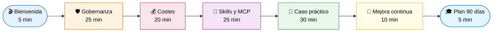

<div align="center">

# 🚀 Workshop · GitHub Copilot para Telefónica

### *Gobernanza, costes, extensibilidad y adopción aterrizados al stack corporativo*

[](./LICENSE)
[](https://github.com/features/copilot)
[](https://github.com/chapi-dev/telefonica-copilot-workshop/actions/workflows/validate.yml)
[](https://chapi-dev.github.io/telefonica-copilot-workshop/)
[](https://github.com/chapi-dev/telefonica-copilot-workshop/stargazers)

[](#-agenda-detallada-120-min)
[](#-audiencia-objetivo)
[](#)
[](#)
[](./CODE_OF_CONDUCT.md)

🌐 **[Ver versión web →](https://chapi-dev.github.io/telefonica-copilot-workshop/)**

**📅 Miércoles 20 de mayo de 2026 · 🕚 11:00 – 13:00 (CET)**

</div>


> ⚠️ **Disclaimer:** material **educativo y de comunidad**, creado por [@chapi-dev](https://github.com/chapi-dev). No es contenido oficial de Telefónica S.A. ni de GitHub, Inc. Las marcas "Telefónica" y "GitHub Copilot" pertenecen a sus respectivos titulares y se utilizan solo con fines descriptivos del público y herramienta del workshop.

---

## 🗺️ Vista de un vistazo



---

## ✨ ¿Qué encontrarás aquí?

Un **workshop completo de 2 horas** sobre GitHub Copilot a nivel **enterprise**, con:

- 🛡️ Bloques de **gobernanza** con rutas exactas en GitHub.com.
- 💰 Estrategia de **costes** y scripts reales para detectar idle seats.
- 🔌 Extensión vía **MCP, Custom Instructions, Prompt Files y Extensions**.
- 🧪 **Caso práctico live** con los 3 modos (Ask / Edit / Agent).
- 🔁 **Plan 90 días** para mejora continua.

Todo el material es **reutilizable**: clónalo, sustituye los placeholders `<...>` por los de tu organización y tendrás un workshop listo en menos de una hora.

---

## 🎯 Objetivos del workshop

Al finalizar, los asistentes serán capaces de:

| # | Objetivo |
|---|----------|
| 1 | **Gobernar** Copilot a nivel Enterprise/Org con políticas, content exclusions y auditoría continua. |
| 2 | **Modelar y optimizar el coste** de Copilot identificando idle seats y midiendo ROI con datos reales. |
| 3 | **Extender** Copilot con MCP servers, Copilot Extensions, custom instructions y prompt files. |
| 4 | **Aplicar patrones efectivos** de uso (Ask / Edit / Agent) en flujos reales de desarrollo. |
| 5 | **Establecer un ciclo de mejora continua** basado en métricas, encuestas y red de campeones. |

---

## 📅 Agenda detallada (120 min)

| ⏰ Hora        | 📚 Bloque                                          | ⏱ Duración | 📄 Archivo |
|---------------|----------------------------------------------------|-----------|-----------|
| 11:00 – 11:05 | Bienvenida, objetivos y reglas del juego           | 5 min     | [00-bienvenida-y-objetivos.md](./00-bienvenida-y-objetivos.md) |
| 11:05 – 11:30 | 🛡️ **1. Gobernanza y control**                     | 25 min    | [01-gobernanza-y-control.md](./01-gobernanza-y-control.md) |
| 11:30 – 11:50 | 💡 **2. Optimización de consumo**                   | 20 min    | [02-modelo-de-costes.md](./02-modelo-de-costes.md) |
| 11:50 – 12:15 | 🔌 **3. Skills y conectores**                       | 25 min    | [03-skills-y-conectores.md](./03-skills-y-conectores.md) |
| 12:15 – 12:45 | 🧪 **4. Caso práctico (live coding)**               | 30 min    | [04-caso-practico.md](./04-caso-practico.md) |
| 12:45 – 12:55 | 🔁 **5. Optimización continua**                     | 10 min    | [05-optimizacion-continua.md](./05-optimizacion-continua.md) |
| 12:55 – 13:00 | Q&A, próximos pasos y cierre                       | 5 min     | – |

> ⏱️ Cada módulo incluye: **contexto · pasos exactos en GitHub.com · CLI/API · demo · checklist de salida**.

---

## 🎯 Audiencia objetivo

| Rol | Bloques de mayor interés |
|-----|--------------------------|
| 👑 **Enterprise / Org Owner** | 1, 2, 5 |
| 🛡️ **SecOps / CISO team** | 1, 5 |
| 💰 **FinOps** | 2, 5 |
| ⚙️ **Plataforma / DevEx** | 1, 3, 5 |
| 🏗️ **Tech Leads** | 3, 4 |
| 🧑‍💻 **Devs / Champions** | 3, 4, 5 |

---

## 🧰 Prerrequisitos técnicos

Antes del workshop, cada asistente debe tener:

- [ ] Cuenta GitHub conectada al **tenant Enterprise de Telefónica** (SSO operativo).
- [ ] **Copilot Business o Enterprise** asignado (verificar en `https://github.com/settings/copilot`).
- [ ] **VS Code** + extensiones: `GitHub Copilot`, `GitHub Copilot Chat`, `GitHub Pull Requests`.
- [ ] **GitHub CLI** (`gh`) instalado y autenticado:
  ```bash
  gh auth login --scopes "repo,read:org,workflow,manage_billing:copilot,read:audit_log"
  ```
- [ ] **Node.js 20+** y **Python 3.11+** (para el lab de MCP y Skills).
- [ ] Permisos sobre un repo sandbox (`telefonica-sandbox/copilot-workshop-<usuario>`).

Para roles de **gobernanza** se requiere adicionalmente:
- Rol `Enterprise Owner` o `Organization Owner` en al menos un entorno de pruebas.
- Acceso al **Enterprise Account** (`https://github.com/enterprises/<telefonica-enterprise>`).

> 📋 Checklist completa en [`anexos/checklist-pre-workshop.md`](./anexos/checklist-pre-workshop.md).

---

## 🧪 Entorno de prueba (sandbox)

| Recurso | Nombre |
|---------|--------|
| Enterprise | `telefonica-copilot-lab` |
| Org | `telefonica-sandbox` |
| Repo backend demo | `telefonica-sandbox/payments-api` |
| Repo migración demo | `telefonica-sandbox/legacy-cobol-port` |
| Repo plantilla | `telefonica-sandbox/copilot-instructions-demo` |

> ⚠️ **Nada de datos reales.** Todo el código y datasets del sandbox son sintéticos.

---

## 🗂️ Estructura del repositorio

```
.
├── 📄 README.md                        ← este archivo
├── 📄 LICENSE                          ← MIT
├── 📄 CONTRIBUTING.md
├── 📄 .gitignore
│
├── 📘 00-bienvenida-y-objetivos.md
├── 🛡️ 01-gobernanza-y-control.md
├── 💰 02-modelo-de-costes.md
├── 🔌 03-skills-y-conectores.md
├── 🧪 04-caso-practico.md
├── 🔁 05-optimizacion-continua.md
│
├── 📂 anexos/
│   ├── checklist-pre-workshop.md
│   ├── checklist-gobernanza.md
│   ├── identidad-emu-sso.md            ← deep dive EMU + SSO/SCIM (Entra ID + on-prem)
│   ├── recursos-y-enlaces.md
│   ├── 📂 plantillas/
│   │   ├── copilot-instructions.md      ← listo para .github/
│   │   ├── content-exclusions.yml       ← aplicable vía API
│   │   ├── mcp-config.json              ← .vscode/mcp.json corporativo
│   │   └── policy-matrix.md             ← matriz para SecOps + FinOps + DPO
│   └── 📂 scripts/
│       ├── bootstrap-emu-enterprise.ps1 ← crea Orgs + Copilot policies + seats (EMU)
│       ├── pull-copilot-metrics.ps1     ← snapshot Metrics API → CSV
│       ├── identify-idle-seats.ps1      ← idle seats + ahorro estimado
│       ├── export-audit-log.ps1         ← export audit log para evidencia
│       └── kql-audit-queries.md         ← 10 queries Sentinel listas
│
└── 📂 facilitador/
    ├── guion-facilitador.md             ← speaker notes minuto a minuto
    └── preguntas-frecuentes.md          ← 40+ FAQs reales
```

---

## ⚡ Quick start

```bash
# 1. Clonar
git clone https://github.com/chapi-dev/telefonica-copilot-workshop.git
cd telefonica-copilot-workshop

# 2. Verificar prerequisitos
pwsh -File anexos/scripts/pull-copilot-metrics.ps1 -Org <tu-org-sandbox>

# 3. Aplicar content exclusions a una org sandbox
gh api --method PUT /orgs/<tu-org>/copilot/content-exclusions \
  --input anexos/plantillas/content-exclusions.yml

# 4. Detectar idle seats
pwsh -File anexos/scripts/identify-idle-seats.ps1 -Org <tu-org>

# 5. Copiar custom instructions a un repo tuyo
cp anexos/plantillas/copilot-instructions.md <tu-repo>/.github/
```

---

## 📤 Entregables post-workshop

Al cierre, cada asistente se llevará:

1. ✅ **Policy matrix** rellena para su BU (basada en [`anexos/plantillas/policy-matrix.md`](./anexos/plantillas/policy-matrix.md)).
2. 📊 **Dashboard de adopción** con datos reales de los últimos 28 días.
3. 📝 **`copilot-instructions.md`** funcional para al menos un repo productivo.
4. 🗓️ **Plan de mejora continua a 90 días** (template incluido en [módulo 5](./05-optimizacion-continua.md)).

---

## 📚 Recursos

| Categoría | Link |
|-----------|------|
| 📘 Doc oficial Copilot | https://docs.github.com/en/copilot |
| 🔒 Copilot Trust Center | https://copilot.github.trust.page/ |
| 📰 Changelog | https://github.blog/changelog/label/copilot/ |
| 🔌 MCP Spec | https://modelcontextprotocol.io/ |
| 📂 Recursos completos | [`anexos/recursos-y-enlaces.md`](./anexos/recursos-y-enlaces.md) |

---

## 🤝 Cómo contribuir

¿Has detectado una errata, una URL que cambió o quieres aportar una plantilla nueva? Échale un ojo a [`CONTRIBUTING.md`](./CONTRIBUTING.md). Cualquier PR es bienvenido — desde correcciones tipográficas hasta variantes para otras compañías.

---

## ⭐ Si te ha sido útil

Dale una estrella al repo — ayuda a que llegue a más equipos que estén afrontando el mismo viaje con Copilot.

---

## 📜 Licencia

[MIT](./LICENSE) © 2026 [Antonio Chapinal Reyes](https://github.com/chapi-dev)

Eres libre de copiarlo, adaptarlo y usarlo en tu empresa. Si lo haces, una mención sería muy de agradecer 💙.

---

<div align="center">

**Hecho con ❤️ y ☕ en Madrid · Powered by [GitHub Copilot](https://github.com/features/copilot)**

</div>
