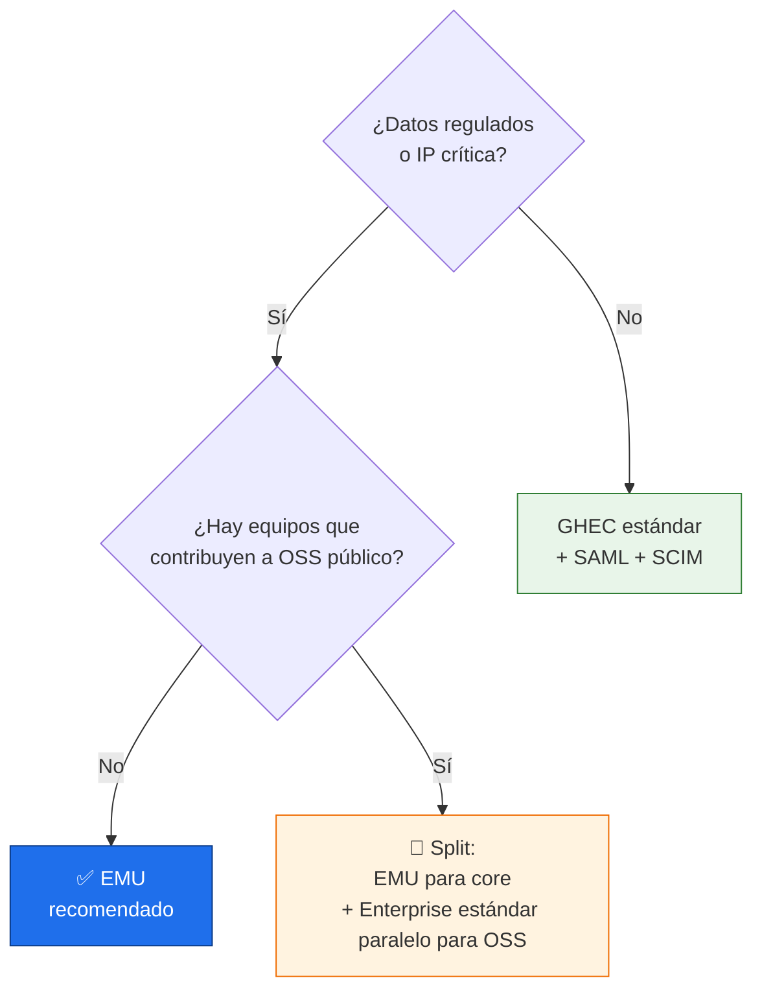
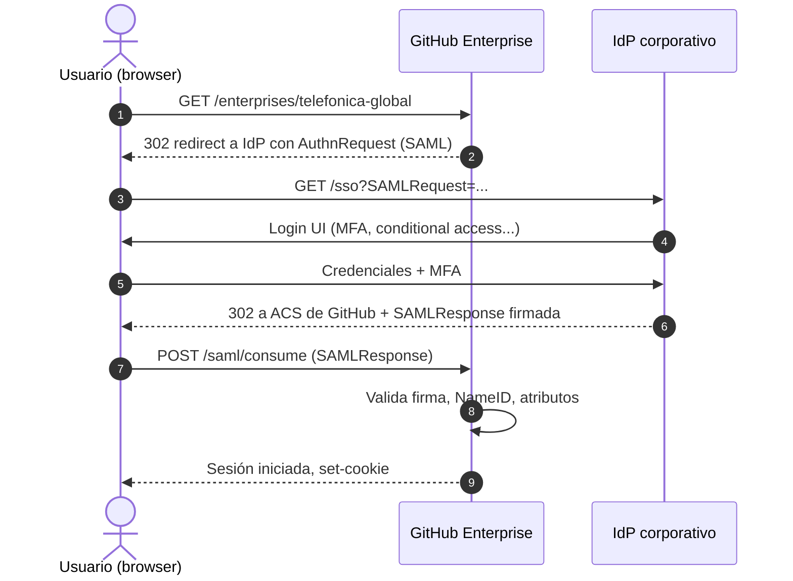
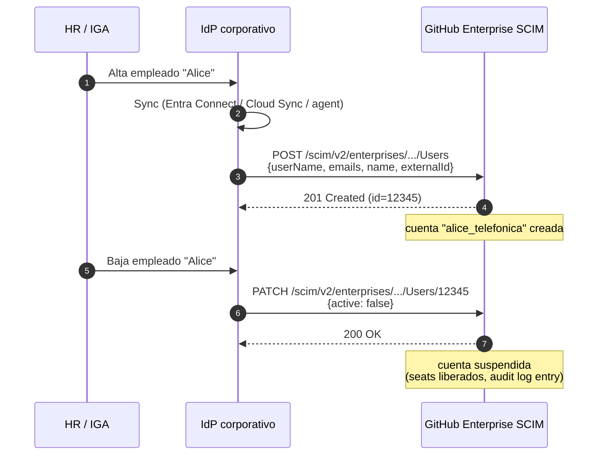
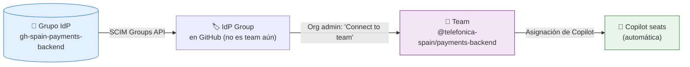
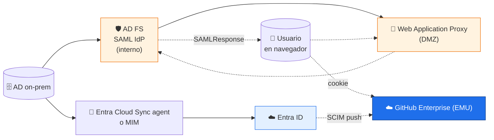
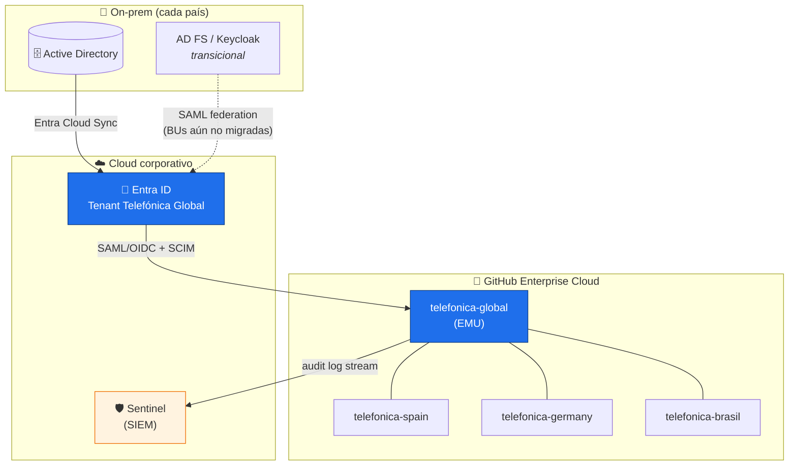

# 🆔 Identidad, EMU y SSO — Deep dive (Entra ID + on-prem)

> Material de referencia complementario al [§1 del módulo 01](../01-gobernanza-y-control.md#1-gestión-de-accesos).  
> Pensado para **Enterprise Owners, SecOps e IT corporativo** que tienen que diseñar la
> federación de Telefónica con GitHub Enterprise Cloud, decidir entre EMU y GHEC estándar,
> y montar SSO + SCIM sea con Entra ID (cloud) o con un IdP on-prem (AD FS, Keycloak,
> PingFederate, Okta on-prem).

---

## 🗺️ Índice

1. [Modelo mental y vocabulario](#1-modelo-mental-y-vocabulario)
2. [Decisión: EMU vs GHEC estándar](#2-decisión-emu-vs-ghec-estándar)
3. [Flujos SAML y SCIM (cómo funcionan por dentro)](#3-flujos-saml-y-scim-cómo-funcionan-por-dentro)
4. [Setup con Entra ID (Azure) — completo](#4-setup-con-entra-id-azure--completo)
5. [Setup con AD FS on-prem — completo](#5-setup-con-ad-fs-on-prem--completo)
6. [Setup con Keycloak — completo](#6-setup-con-keycloak--completo)
7. [PingFederate y Okta on-prem (resumen)](#7-pingfederate-y-okta-on-prem-resumen)
8. [Patrón híbrido recomendado para Telefónica](#8-patrón-híbrido-recomendado-para-telefónica)
9. [Troubleshooting (los 12 fallos más típicos)](#9-troubleshooting-los-12-fallos-más-típicos)
10. [Runbook de rotación de certificados y tokens](#10-runbook-de-rotación-de-certificados-y-tokens)

---

## 1. Modelo mental y vocabulario

| Término | Qué es | Quién lo gestiona |
|---------|--------|--------------------|
| **Enterprise Account** | Contenedor top-level GHEC. 1 por compañía. | Enterprise Owners |
| **Organization** | Tenant de repos y teams dentro del Enterprise. | Org Owners |
| **Team** | Agrupación de usuarios con permisos sobre repos. Puede estar **sincronizado** con un grupo del IdP. | Team maintainers |
| **EMU** (Enterprise Managed Users) | Modalidad del Enterprise en la que el IdP es la única fuente de identidad. | Enterprise Owners + IdP admins |
| **SAML 2.0** | Protocolo de **autenticación** (login). El IdP firma una `SAMLResponse` que GitHub valida. | IdP team |
| **SCIM 2.0** | Protocolo de **provisioning** (alta/baja/modificación). El IdP llama a `api.github.com/scim/v2/...`. | IdP team |
| **OIDC** | Alternativa moderna a SAML, basada en OAuth2 + JWT. Solo soportado en EMU con Entra ID. | IdP team |
| **Push de grupos / Group sync** | Mecanismo SCIM que crea automáticamente teams en GitHub a partir de grupos del IdP. | IdP + Org Owners |
| **Suffix EMU** | Cadena que se añade a cada username (`alice_telefonica`). Decidida 1 sola vez. | Enterprise Owner |

---

## 2. Decisión: EMU vs GHEC estándar

### 2.1 Árbol de decisión rápido



### 2.2 Tabla de capacidades

| Capacidad | GHEC estándar | EMU |
|-----------|---------------|-----|
| SSO obligatorio | Opcional (recomendado) | ✅ Obligatorio |
| SCIM obligatorio | Opcional | ✅ Obligatorio |
| Username del usuario | El que él eligió en GitHub.com | `<idp-attr>_<suffix>` |
| Login externo (GitHub.com personal) | Permitido | ❌ Bloqueado |
| Repos personales | ✅ | ❌ |
| Marketplace público | ✅ | Solo allow-list |
| Verificación de dominio | Necesaria para SSO | Implícita |
| Reversible | ✅ | ❌ Nuevo Enterprise para revertir |
| IdPs soportados | SAML (cualquiera) + OIDC con Entra | SAML (Entra/Okta/Ping/PingOne) o OIDC (Entra) |
| Audit log de identidad | Estándar | Extendido (ciclo de vida completo) |
| Coste licencia | Mismo precio | Mismo precio |
| Coste operativo | Bajo | Medio (gestión IdP estricta) |

### 2.3 Coste oculto a considerar (EMU)

- **Re-onboarding de cuentas existentes:** todos los devs que ya tenían cuenta en GHEC
  estándar pasarán a tener una cuenta nueva `_telefonica`. Sus contribuciones previas no
  migran automáticamente.
- **Integraciones rotas temporalmente:** webhooks, bots, OAuth apps que asumían usernames
  antiguos hay que reauthorizar.
- **Formación:** los devs deben entender que la cuenta corporativa **no es** su cuenta
  personal. Material de onboarding obligatorio.

---

## 3. Flujos SAML y SCIM (cómo funcionan por dentro)

### 3.1 SAML SP-initiated (el flujo de login normal)



> 🔑 GitHub **nunca** habla directamente con el IdP en este flujo. Todo va por el
> navegador del usuario. Por eso un IdP on-prem solo necesita ser alcanzable por los
> usuarios (intranet o VPN), no por GitHub.

### 3.2 SCIM provisioning (el flujo del ciclo de vida)



> 🔑 SCIM **sí necesita** salida HTTPS desde el IdP hacia `api.github.com`. Si tu IdP
> está on-prem detrás de proxy corporativo, hay que whitelistar
> `api.github.com` en el firewall outbound.

### 3.3 Group sync (cómo se materializan los teams)



---

## 4. Setup con Entra ID (Azure) — completo

### 4.1 Pre-requisitos

- Tenant de Entra ID con licencia **P1 o P2** (necesaria para asignar grupos a apps).
- Cuenta con rol **Application Administrator** o **Cloud Application Administrator** en Entra.
- Enterprise Owner en GitHub.
- (EMU) Enterprise ya provisionado por GitHub Support.

### 4.2 Crear la Enterprise Application

1. Portal Azure → **Entra ID → Enterprise applications → New application**.
2. Buscar:
   - Para EMU: **"GitHub Enterprise Managed User"** (hay una variante OIDC).
   - Para GHEC estándar: **"GitHub Enterprise Cloud — Enterprise Account"**.
3. *Add* → asignar un nombre amigable: `GitHub - telefonica-global (PROD)`.

### 4.3 Configurar SAML

| Campo | Valor |
|-------|-------|
| Identifier (Entity ID) | `https://github.com/enterprises/telefonica-global` |
| Reply URL (ACS) | `https://github.com/enterprises/telefonica-global/saml/consume` |
| Sign on URL | `https://github.com/enterprises/telefonica-global/sso` |
| Relay State | (vacío) |
| Logout URL | `https://github.com/enterprises/telefonica-global/saml/sls` |

**Atributos y Claims:**

| Claim Name | Source attribute |
|------------|-------------------|
| Unique User Identifier (Name ID) | `user.userprincipalname` (formato: emailAddress) |
| `emails[0].value` | `user.mail` |
| `name.givenName` | `user.givenname` |
| `name.familyName` | `user.surname` |
| `externalId` | `user.objectid` |

Descargar el **Federation Metadata XML** y guardarlo (lo subirás a GitHub).

### 4.4 Habilitar SSO en GitHub

```bash
# Si prefieres UI: https://github.com/enterprises/telefonica-global/settings/single_sign_on
# Si automatizas, los campos críticos son:
# - Sign on URL  (Login URL de Entra)
# - Issuer       (Entity ID de Entra)
# - Public Certificate (descargado del metadata)
```

Activar **"Require SAML SSO authentication for all users"** y testear con una cuenta nueva
en una **ventana de incógnito** antes de cerrar la sesión administrativa actual.

### 4.5 Configurar SCIM

1. En GitHub: `Settings → Personal access tokens (classic) → Generate new token`
   - Scope: **`scim:enterprise`**
   - Expiración: **1 año** (poner recordatorio en calendario a 11 meses).
2. En Entra ID, en la app → **Provisioning → Get started → Automatic**.
3. Admin credentials:
   - Tenant URL: `https://api.github.com/scim/v2/enterprises/telefonica-global`
   - Secret Token: el PAT del paso 1.
4. **Test connection** → debe devolver "Test connection successful".
5. Mapeo de atributos: dejar el de la galería. Verificar:
   - `userName` ← `mail` (sin suffix; GitHub añade `_telefonica`).
   - `externalId` ← `objectId` (estable, no cambia si se renombra el usuario).
6. **Save → Start provisioning**.

### 4.6 Push de grupos

1. App → **Users and groups** → asignar:
   - `gh-spain-payments-backend`
   - `gh-spain-payments-frontend`
   - `gh-tech-core-sre`
   - ...
2. App → **Provisioning → Settings → Provision Microsoft Entra groups** = **Yes**.
3. Esperar el primer ciclo (cada 40 min) o lanzar **Provision on demand** para un grupo.
4. En GitHub: `Org settings → Identity provider → Synced teams` → conectar cada grupo a un team.

### 4.7 Conditional Access — política mínima

```text
Name: GitHub Enterprise - Baseline
Assignments:
  Users: All users (Exclude: emergency-access-accounts)
  Cloud apps: GitHub - telefonica-global (PROD)
Conditions:
  Sign-in risk: Medium and above
  Client apps: Browser, Mobile apps and desktop clients
Grant:
  Require multi-factor authentication ✓
  Require device to be marked as compliant ✓
  Require approved client app ✓ (opcional)
Session:
  Sign-in frequency: 12 hours
  Persistent browser session: Never persistent
```

---

## 5. Setup con AD FS on-prem — completo

### 5.1 Cuándo elegir AD FS

- Hay un AD FS ya en producción y migrar a Entra ID no es viable en el plazo del proyecto.
- Política de la BU impide externalizar el IdP.
- AD FS sigue siendo la fuente para otras apps críticas.

> ⚠️ **AD FS no hace SCIM nativamente.** Necesitas combinarlo con Entra Cloud Sync, MIM,
> Saviynt o un script propio (no recomendado). Sin SCIM no puedes activar EMU.

### 5.2 Arquitectura



### 5.3 Crear el Relying Party Trust en AD FS

**Por UI** (AD FS Management Console):

1. *Relying Party Trusts → Add Relying Party Trust*.
2. Claims aware.
3. **Import data about the relying party published online** → URL:
   `https://github.com/enterprises/telefonica-global/saml/metadata`
4. Display name: `GitHub EMU - telefonica-global`.
5. Access control policy: *Permit specific group* → grupo AD `GH-Allowed-Users`.
6. Finish → marcar *Configure claims issuance policy*.

**Claim rules mínimas (Edit Claim Issuance Policy → Add Rule → Send LDAP Attributes as Claims):**

| LDAP Attribute | Outgoing Claim Type |
|----------------|---------------------|
| `mail` | `Name ID` (Format: Email) |
| `mail` | `emails[0].value` |
| `givenName` | `name.givenName` |
| `sn` | `name.familyName` |
| `objectGUID` | `externalId` |

**Por PowerShell** (idempotente, recomendado para IaC):

```powershell
# Ejecutar en el server primario de AD FS, como Admin
$rpName = "GitHub EMU - telefonica-global"
$metadataUrl = "https://github.com/enterprises/telefonica-global/saml/metadata"

# Crear/actualizar el Relying Party Trust
if (-not (Get-AdfsRelyingPartyTrust -Name $rpName)) {
    Add-AdfsRelyingPartyTrust `
        -Name $rpName `
        -MetadataUrl $metadataUrl `
        -IssuanceAuthorizationRules '@RuleTemplate = "AllowAllAuthzRule" => issue(Type = "http://schemas.microsoft.com/authorization/claims/permit", Value = "true");'
}

# Reglas de claims (issuance transform)
$claimRules = @"
@RuleTemplate = "LdapClaims"
@RuleName = "GitHub identity claims"
c:[Type == "http://schemas.microsoft.com/ws/2008/06/identity/claims/windowsaccountname", Issuer == "AD AUTHORITY"]
 => issue(store = "Active Directory",
          types = ("http://schemas.xmlsoap.org/ws/2005/05/identity/claims/nameidentifier",
                   "http://schemas.xmlsoap.org/ws/2005/05/identity/claims/emailaddress",
                   "http://schemas.xmlsoap.org/ws/2005/05/identity/claims/givenname",
                   "http://schemas.xmlsoap.org/ws/2005/05/identity/claims/surname"),
          query = ";mail,mail,givenName,sn;{0}",
          param = c.Value);
"@

Set-AdfsRelyingPartyTrust `
    -TargetName $rpName `
    -IssuanceTransformRules $claimRules

# Forzar el NameID a formato Email (importante: GitHub lo espera así)
Set-AdfsRelyingPartyTrust `
    -TargetName $rpName `
    -SamlResponseSignature "MessageAndAssertion"
```

### 5.4 Publicar AD FS via Web Application Proxy (WAP)

```powershell
# En el server WAP en DMZ
Install-WindowsFeature Web-Application-Proxy -IncludeManagementTools

Install-WebApplicationProxy `
    -CertificateThumbprint "<thumbprint del cert público de adfs.telefonica.com>" `
    -FederationServiceName "adfs.telefonica.com"

# Publicar el endpoint de AD FS
Add-WebApplicationProxyApplication `
    -Name "AD FS - SSO" `
    -ExternalPreauthentication ADFS `
    -ExternalUrl "https://adfs.telefonica.com/" `
    -BackendServerUrl "https://adfs-internal.telefonica.local/" `
    -ExternalCertificateThumbprint "<thumbprint>"
```

### 5.5 SCIM via Entra Cloud Sync (la pieza que falta)

1. Habilitar **Entra Connect Cloud Sync** en el tenant de Entra ID.
2. Instalar el **provisioning agent** en un server Windows con línea a los DCs.
3. Configurar el scope: OUs de AD que se sincronizan a Entra.
4. Desde Entra ID, montar la app **GitHub Enterprise Managed User** (como en §4) y
   activar **provisioning** apuntando a la API SCIM de GitHub.
5. Resultado: AD sigue siendo source of truth, Entra hace de bridge SCIM, GitHub recibe
   los usuarios con sus atributos.

> ✅ Este es el patrón **híbrido recomendado** para BUs en migración.

---

## 6. Setup con Keycloak — completo

### 6.1 Cuándo elegir Keycloak

- Proyecto interno open source, sin contrato Microsoft para Entra P1/P2.
- BU con stack 100% Linux y aversión a tooling Microsoft.
- Necesidad de identity brokering complejo (chain a LDAP, social IdPs, etc.).

### 6.2 SAML client

1. Realm → **Clients → Create client**.
   - Client type: **SAML**
   - Client ID: `https://github.com/enterprises/telefonica-global`
   - Valid redirect URIs: `https://github.com/enterprises/telefonica-global/*`
   - Master SAML Processing URL: `https://github.com/enterprises/telefonica-global/saml/consume`
   - Name ID format: `email`
   - Force POST binding: ON
   - Sign assertions: ON
   - Sign documents: ON

2. **Client Scopes → dedicated → Add mapper → User Attribute / User Property:**

   | Mapper | User Attribute | SAML Attribute Name |
   |--------|----------------|---------------------|
   | Email | `email` | `emails[0].value` |
   | First Name | `firstName` | `name.givenName` |
   | Last Name | `lastName` | `name.familyName` |
   | External ID | `id` | `externalId` |

3. Descargar el **SAML Metadata IDPSSODescriptor** desde `/realms/<realm>/protocol/saml/descriptor`
   y subirlo a GitHub.

### 6.3 SCIM en Keycloak

Keycloak **no trae SCIM Server Provider de fábrica**. Opciones:

| Opción | Pros | Contras |
|--------|------|---------|
| Plugin [`scim-for-keycloak`](https://github.com/Captain-P-Goldfish/scim-for-keycloak) | Open source, mantenido | Necesita rebuild del WAR / extension config |
| Plugin comercial (e.g. Phase Two) | Soporte, SLA | Coste licencia |
| Bridge con MIM o Saviynt | Robusto, multi-target | Pesado de operar |
| Script custom + Keycloak Admin API + GitHub SCIM API | Flexible | **No usar en producción**, mantenimiento alto |

**Instalación rápida del plugin (lab):**

```bash
# Dentro del container Keycloak
cd /opt/keycloak/providers
curl -LO https://github.com/Captain-P-Goldfish/scim-for-keycloak/releases/latest/download/scim-for-keycloak-kc-25-X.X.X-final.jar

# Rebuild
/opt/keycloak/bin/kc.sh build
/opt/keycloak/bin/kc.sh start
```

Luego, en la UI del plugin (`/auth/admin/<realm>/console/#/<realm>/scim`):
- Crear un **SCIM Service Provider** apuntando a `https://api.github.com/scim/v2/enterprises/telefonica-global`.
- Pegar el PAT con scope `scim:enterprise`.
- Mapear atributos (`username → userName`, `email → emails[0].value`, etc.).

---

## 7. PingFederate y Okta on-prem (resumen)

### 7.1 PingFederate

- **App de la galería:** "GitHub Enterprise Cloud — Enterprise Account" / "EMU".
- SAML connector estándar + atributos.
- SCIM nativo a través de **PingDirectory** o **PingOne** como provisioner.
- Patrón: PingFederate on-prem + PingDirectory como user store + outbound SCIM a GitHub.

### 7.2 Okta on-prem (AD Agent híbrido)

- Aunque hablamos de "on-prem", el plano de control de Okta es cloud; solo el **AD Agent**
  vive en DMZ para leer del AD corporativo.
- App de la galería **GitHub Enterprise Cloud — EMU** o estándar.
- SAML + SCIM out of the box.
- Push groups soportado, mapeo directo a teams.

> Para ambos, los pasos en GitHub (subir metadata, activar SSO, generar PAT SCIM, conectar
> teams) son **idénticos** a §4.4–4.6.

---

## 8. Patrón híbrido recomendado para Telefónica



**Decisiones explícitas del patrón:**

1. **Una sola federación con GitHub: Entra ID.** Aunque internamente convivan AD FS y
   Keycloak, el contrato con GitHub es 1 IdP → menos puntos de fallo, menos certificados a
   rotar.
2. **AD on-prem sigue siendo source of truth de identidad** mediante Entra Cloud Sync.
3. **EMU activado** en `telefonica-global`, con suffix `_telefonica`.
4. **1 Org por país / BU regulada**, teams sincronizados desde grupos de Entra ID con
   convención `gh-<org>-<team>`.
5. **Audit log** stream hacia Sentinel (Event Hubs) con retención WORM ≥ 2 años.

---

## 9. Troubleshooting (los 12 fallos más típicos)

| # | Síntoma | Causa probable | Cómo confirmarlo | Fix |
|---|---------|----------------|-------------------|-----|
| 1 | `SAMLResponse rejected: signature validation failed` | Cert IdP rotado y no subido a GitHub | Comparar thumbprint del cert en metadata vs en GitHub | Subir nuevo cert (sin downtime: subir el segundo, retirar el viejo) |
| 2 | `NameID does not match a known user` | NameID format ≠ Email, o atributo IdP cambió | Inspeccionar SAML response con SAML-tracer (Firefox add-on) | Forzar NameID = email en el IdP |
| 3 | SCIM `401 Unauthorized` | PAT expirado o rotado | `gh api /scim/v2/enterprises/<ent>/Users?count=1 -H "Authorization: Bearer <pat>"` | Generar nuevo PAT, actualizar en IdP, **anotar fecha de expiración** |
| 4 | SCIM `404 Not Found` | Tenant URL mal formada | Comprobar que es `/scim/v2/enterprises/<slug>` y no `/orgs/<slug>` | Corregir URL en provisioning settings |
| 5 | Usuarios creados sin email | Mapeo de atributo incorrecto | Ver `emails` en el JSON SCIM enviado | Ajustar mapeo `mail → emails[0].value` |
| 6 | Grupos del IdP no aparecen como synced teams | "Provision groups" desactivado, o grupo no asignado a la app | Provisioning logs en Entra | Activar provisioning de grupos + reasignar |
| 7 | Team sincronizado no actualiza miembros | Ciclo SCIM lento (40 min default) | Provisioning → Provision on demand → user | Esperar o forzar on-demand |
| 8 | Usuario hace SSO y aterriza en GitHub.com sin Enterprise | Falta `Require SAML SSO for all users` | Settings → SSO | Marcar el checkbox |
| 9 | Usuario EMU intenta acceder a repos públicos y falla | Comportamiento esperado | n/a | Comunicarlo en onboarding |
| 10 | AD FS no responde tras reinicio | El servicio `adfssrv` no arranca por cert expirado | `Get-AdfsCertificate` | Renovar `Service-Communications` cert |
| 11 | Conditional Access bloquea bots / service accounts | Política aplicada a "All users" sin exclusión | Sign-in logs en Entra | Excluir grupo `gh-service-accounts` |
| 12 | Tras activar EMU se pierden contribuciones previas | Es el comportamiento por diseño (cuenta nueva) | n/a | Documentar y comunicar antes del cut-over |

---

## 10. Runbook de rotación de certificados y tokens

### 10.1 Certificado SAML del IdP (Entra ID o AD FS)

- **Cadencia:** cada **2-3 años** (Entra default = 3 años; AD FS = 1 año por defecto, subir a 3).
- **Procedimiento sin downtime:**
  1. Generar el nuevo cert en el IdP (Entra: "New Certificate"; AD FS: `Update-AdfsCertificate`).
  2. **Subirlo a GitHub** como cert secundario (GitHub permite tener dos activos).
  3. Activarlo como "primario" en el IdP.
  4. Esperar 24h y revocar el viejo.
- **Alerta:** Sentinel debe alertar 60 / 30 / 7 días antes de la expiración.

### 10.2 PAT de SCIM (scope `scim:enterprise`)

- **Cadencia:** **anual**, rotación obligatoria en política.
- **Procedimiento:**
  1. Generar nuevo PAT con la misma scope.
  2. Pegarlo en el IdP (Entra → app → Provisioning → editar credentials).
  3. **Test connection** → debe ser verde.
  4. Revocar el viejo en GitHub.
- **Si caduca sin rotar:** SCIM se para, altas/bajas no se reflejan. GitHub no notifica
  por email (a 2026). **Calendar reminder a 11 meses**, sí o sí.

### 10.3 Cert AD FS Token-Signing

- **Cadencia:** anual por defecto, configurable.
- **Auto-rollover:** activado por defecto, pero requiere relying parties que soporten
  metadata refresh. GitHub **no refresca metadata automáticamente** → hay que subir el
  nuevo cert manualmente.
- **Alternativa:** desactivar auto-rollover y rotar manualmente con ventana de cambio
  comunicada.

---

## 📚 Referencias

- [Docs · About Enterprise Managed Users](https://docs.github.com/en/enterprise-cloud@latest/admin/managing-iam/understanding-iam-for-enterprises/about-enterprise-managed-users)
- [Docs · Configuring SAML SSO and SCIM with Entra ID](https://docs.github.com/en/enterprise-cloud@latest/admin/managing-iam/provisioning-user-accounts-with-scim/configuring-scim-provisioning-with-entra-id)
- [Docs · SCIM REST API for Enterprise](https://docs.github.com/en/enterprise-cloud@latest/rest/enterprise-admin/scim)
- [AD FS Operations Guide (Microsoft Learn)](https://learn.microsoft.com/windows-server/identity/ad-fs/operations/ad-fs-operations)
- [scim-for-keycloak (community plugin)](https://github.com/Captain-P-Goldfish/scim-for-keycloak)
- [Entra Cloud Sync vs Connect Sync](https://learn.microsoft.com/entra/identity/hybrid/cloud-sync/what-is-cloud-sync)

---

> 🔁 **Mantenimiento de este documento:** revisar trimestralmente junto con el módulo 01
> y el checklist de gobernanza. Si GitHub cambia el flujo de EMU o aparece soporte SCIM
> nativo en AD FS, actualizar las secciones correspondientes y registrar en
> [`CHANGELOG.md`](../CHANGELOG.md).
